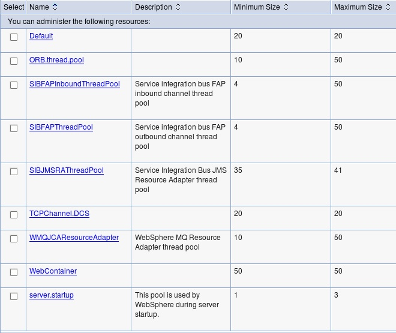
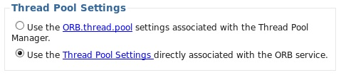
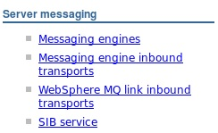

#### Thread Pools
1. Server Thread Pool Manager default Pools
	
	* Default: 
		* The default thread pool used by WAS where no thread pool is set explicitly
		* The thread pool of Process Server SCA runtime SIBus JCA Adapter `Platform Messaging Component SPI Resource Adapter` is set to default
	* ORB.thread.pool:
		* Used by WAS ORB for incoming IIOP requests.  It is not selected by default.  Instead, the ORB service thread pool is used.
		
    * SIBFAPInboundThreadPool:
    	*  Used by SIBus (messagine engines) Inbound channels:
    		*  JMS client connections (JFAP inbound channel)
    		*  SIBus Links from Foreign SIBus (JFAP inbound channel) and WebSphere MQ (MQFAP inbound channel)
    		*  ???Verify: inter-engine channels in the same bus in store-and-forward scenarios where the destination messaging engine hosts the bus destination `queue point`
    		*  The thread pool can be changed in transport chain configuration for SIBus service.  The inbound transport chains and transport channels and their associated thread pools are stored in server.xml
    		
    		*  [Reference: Inbound transport options](http://www-01.ibm.com/support/knowledgecenter/SSAW57_8.5.5/com.ibm.websphere.nd.multiplatform.doc/ae/cjk1000_.html?lang=en)
    * SIBFAPThreadPool:
    	* Used by SIBus (messaging engines) Oubound channels:
    		* Outbound channel connections to foreign bus links (SIBus and MQ)
    		* ???Verify: inter-engine channels in the same bus in store-and-forward scenarios where the source messaging engine defines a `remote queue point`
    		* There is no gui in admin console to change the thread pool but through wsadmin (look at topics `Defining outbound chains for bootstrapping` and `Defining outbound chains for WebSphere MQ interoperation`).  The outbound transport chains and transport channels and their associated thread pools are stored in `server.xml`.  The way 
    		* [Reference: Outbound transport options](http://www-01.ibm.com/support/knowledgecenter/SSAW57_8.5.5/com.ibm.websphere.nd.multiplatform.doc/ae/cjk2000_.html?lang=en)
    *  
2. ORB Service Thread Pool
2. Work Managers and Time Managers Thread Pools
3. EJB asynchronous method invocation Thread Pool
4. Messaging Engine Mediation Thraed Pool

```
Note: Work Manager that is used by JCA adapters is part of JCA framework specification.  It is different from WAS Work Manager.  The Comment that appears when you hover the mouse over `Thread Pool Alias` configuration in Resource Adapter configuration page says `set this property only if the resource adapter uses the work manager service`.  This work manager  service is the one which is part of the JCA specification and provided by JCA framework in any Java EE compliant application server.  So, only if the JCA adpater uses work manager interface to do asynchrounous or background tasks, you need to set the thread pool.
```
* [Reference: JCA 1.5, Part 2: Work management and transaction inflow](http://www.ibm.com/developerworks/java/library/j-jca2/index.html)

### Throttling
* [Configuring MDB or SCA throttling for the default messaging provider](http://www-01.ibm.com/support/knowledgecenter/SSAW57_8.5.5/com.ibm.websphere.nd.multiplatform.doc/ae/tjn0027_.html?lang=en)

#### HTTP Transport Channels
* Persistent connections and number of connections for full proxy load-balancers